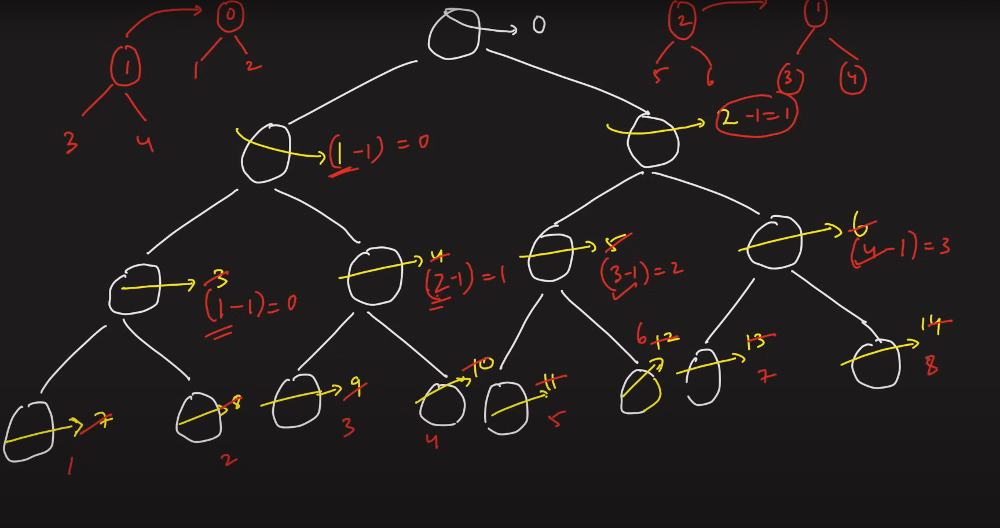
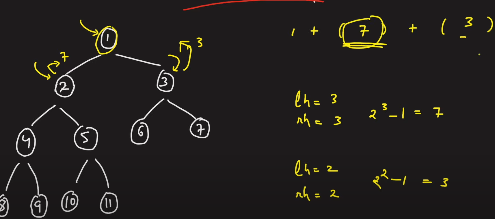

Types of BT :
1. Full binary tree : either two or no leaves nodes
2. Complete binary tree : all levels are completely filled except last level ( filled from left to right)
3. Perfect BT :  all leaves nodes are at same level
4. Balanced BT :  height of BT should be log(n) { n : no. of nodes}. , /balanced tree = height(lef tree) - height(right tree) <=1
5. Degenerate BT : skewed BT.

* Image for Maximum width question Where Segment tree concept is use , indexing is used and further make it 1 , 2 3, to overcome integer overflow , choose minimum from the level than subtract it from current node and then calculate indexing for child node

   

Number of Nodes in a complete binary tree 
